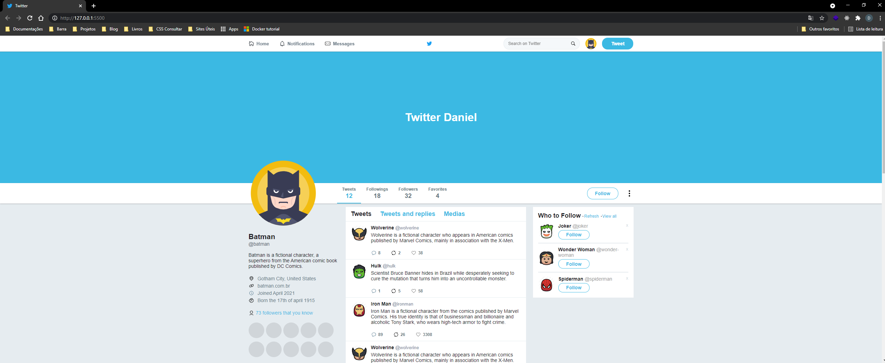
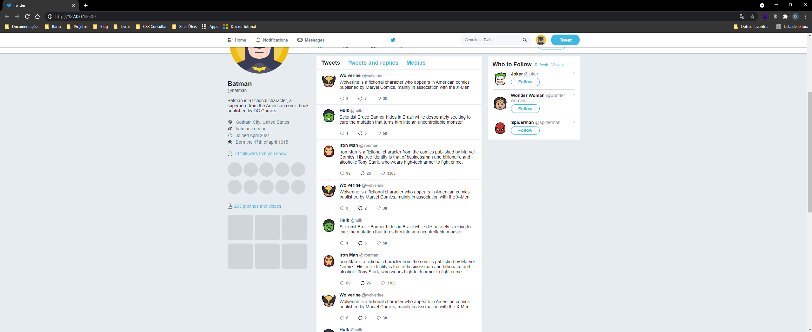
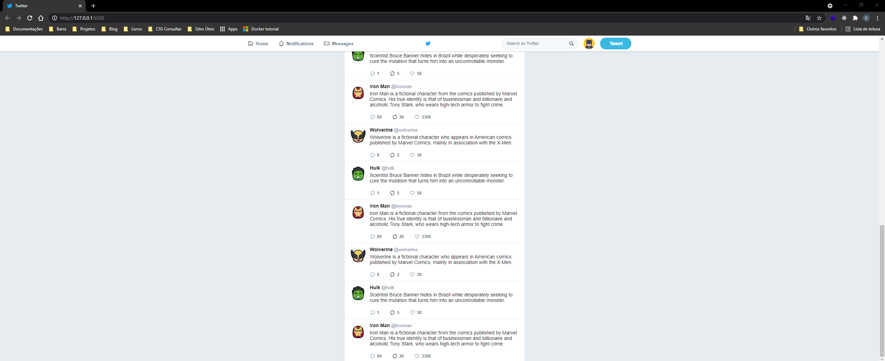

# Twitter Clone

**Desenvolvido no módulo bônus de Flexbox no Treinamento Ignite.**

<h3 align="center">
Projeto finalizado ✅
</h3>

### 👨‍💻Autor 

---

<a href="https://github.com/Daniel-Vinicius" style="text-decoration: none;">

 
 Feito com ❤️ por Daniel Vinícius 👋 Entre em contato!  
</a>
